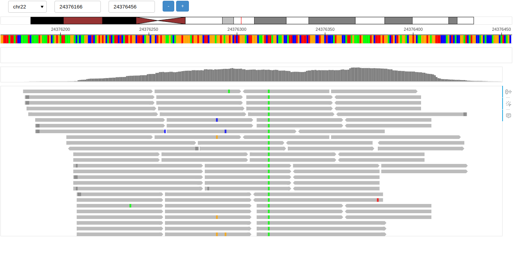

# PileuPy

A python package for visualizing genome browser tracks easily. Built on top of Bokeh to deliver high-performance, customizable visualizations for genomic data.

## Quick start

Generate standalone HTML report
```
from pileupy.main import Pileupy

browser = Pileupy('chr22:24376166-24376456', genome='hg19')
browser.add_track_alignment('gstt1_sample.bam')
browser.show()
```

Start interactive browser
```
from pileupy.main import Pileupy

browser.add_track_alignment('gstt1_sample.bam')
browser.add_track_annotation('mod.bed')
browser.serve()
```

Open the app [http://localhost:5006/](http://localhost:5006/)



## Installation

```
git clone https://github.com/satriobio/pileupy.git 
pip -e .
```

## License

GNU General Public License v3.0
