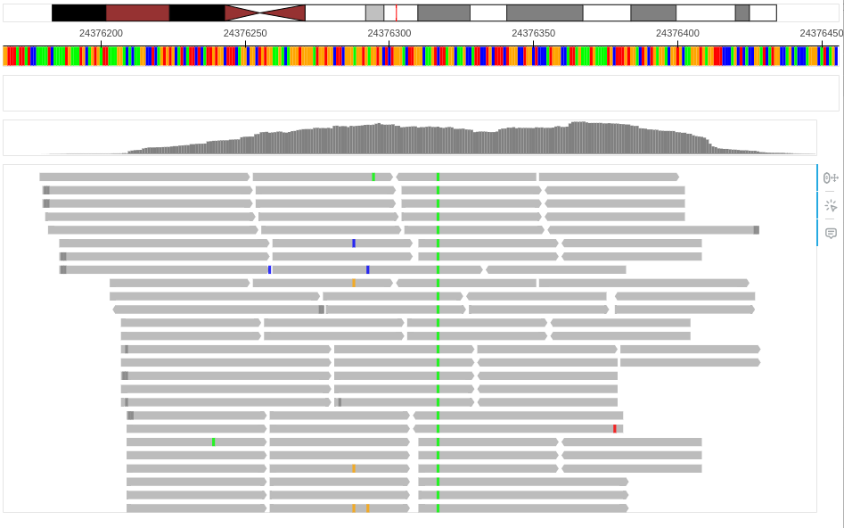
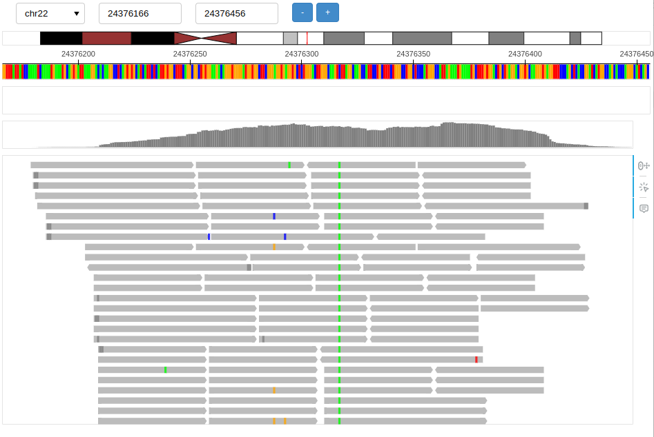
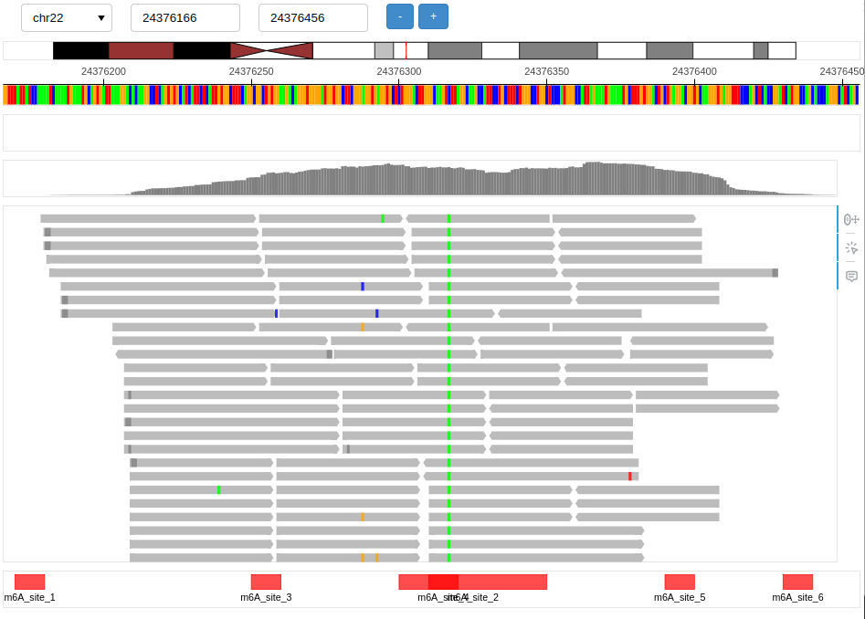
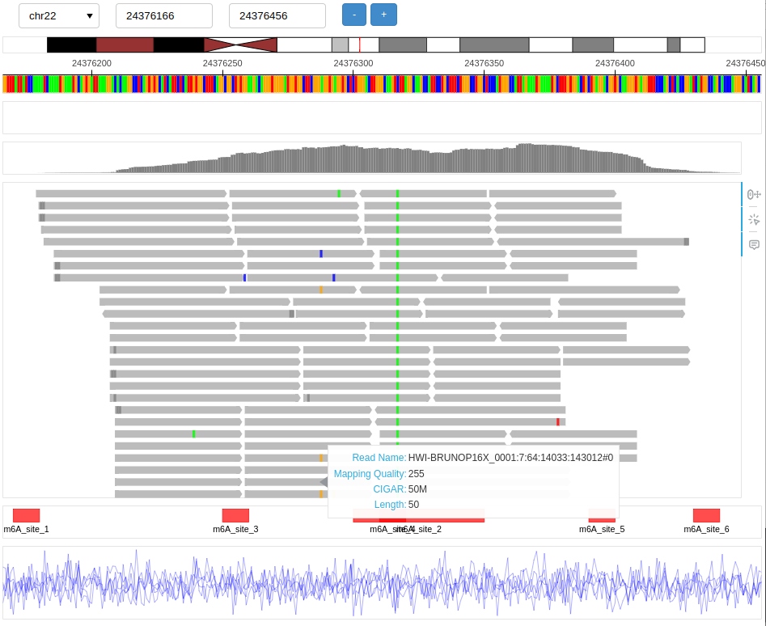

# Usage

## Basic setup

This setup will generate standalone HTML report and open new tab in browser.

```
from pileupy.main import Pileupy

browser = Pileupy('chr22:24376166-24376456', genome='hg19')
browser.add_track_alignment('data/demo.bam')
browser.show()
```



This setup will start interactive genome browser.

```
from pileupy.main import Pileupy

browser = Pileupy('chr22:24376166-24376456', genome='hg19', control=True)
browser.add_track_alignment('data/demo.bam')
browser.serve()
```



## Tracks

### Reference

Choose available genome reference detailed bellow using `genome` or specify reference path using `reference`. Choosing reference from available genome will also load Idiogram and RefSeq track. 

- Human hg19 `hg19`
- Human hg38 `hg38`

```
from pileupy.main import Pileupy

browser = Pileupy('chr22:24376166-24376456', genome='hg19')
# browser = Pileupy('chr22:24376166-24376456', reference='/foo/bar/hg19.fa')
```

### Alignment

Add aligment track using `add_track_alignment`. Format supported is `SAM`, `BAM`, and `CRAM`.

```
from pileupy.main import Pileupy

browser = Pileupy('chr22:24376166-24376456', genome='hg19')
browser.add_track_alignment('data/demo.bam')
```

Disable SNP highlight

```
browser.add_track_alignment('data/demo.bam', snp=False)
```

Group reads by phasing

```
browser.add_track_alignment('data/demo.bam', phasing=True)
```

### Annotations

Add annotation track using `add_track_annotation`. Format supported is `BED`.

```
browser.add_track_annotation('data/mod.bed')
```



### Data Frame

Add data frame track using `add_track_annotation`. Input used is pandas data frame with at least following columns `chrom`, `start`, `value`

```
import pandas as pd
import numpy as np

contig = "chr22"
start = 24376166
end = 24376456
positions = np.arange(start, end + 1)
num_reads = 5  # You can change this number based on the number of reads you want
data = []
for read_id in range(num_reads):
    values = np.random.normal(loc=0, scale=1, size=len(positions))  # Gaussian noise for each read
    read_data = {
        'chrom': [contig] * len(positions),
        'start': positions,
        'end': positions + 1,
        'value': values,
        'read_names': [read_id] * len(positions)
    }
    df_read = pd.DataFrame(read_data)
    data.append(df_read)
final_df = pd.concat(data, ignore_index=True)

browser.add_track_df(final_df)
```

